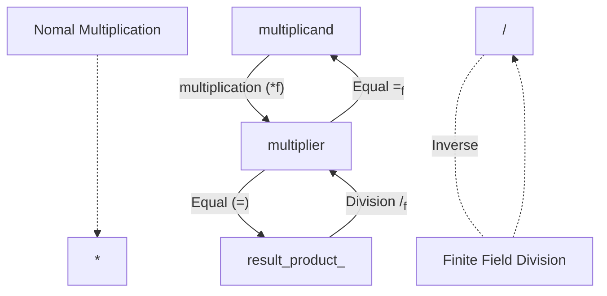

# Finite Field

Basically it's a different way to operate addition, subtractions, multiplication and division considering the existent numbers in vectors. Not all vectors can be Finite Field, they need have some properties. 

> F<sub>x</sub>  = {0,1,2, ... , x -1 } 

### For **Sum** and **Subtractions**:

(12 + 843) % 60 = 15

> The sign % consider the rest of division, in the case rest the division by 60. 

### **Multiplication** and **Exponentiation**:

For F<sub>19</sub>   

3 *<sub>f</sub> 5 = 5 +<sub>f</sub> 5 +<sub>f</sub>  5 = 15 % 19 = 15

> The sign ' f ' means finite field, so ' +<sub>f</sub> ' sum of finite field.


*Resume*: 

  a +<sub>f</sub> b = (a + b)%p

## Division
~~*The hardest logic operation*~~

Normal multiplication


**Intuition**: Inverse of multiplication


9 *<sub>f</sub> 5 =  45 % 19  = 7     implies that     7/<sub>f</sub> 5 = 9 

So complete mindset:




How it really works:

> Fermat’s little theorem, n term and p is prime

$n^{(p–1)}$ %p = 1


> Applying inverse in multiplication

a *<sub>f</sub>b =a *<sub>f</sub> (1 / b) = a *<sub>f</sub> $b^{-1}$

> Applying Fermat's little theorem

$b^{(p–1)}$ = 1

$b^{-1}$ = $b^{-1}$ *<sub>f</sub> 1 = $b^{-1}$ *<sub>f</sub> $b^{(p–1)}$

###∴

$n^{(p–2)}$ %p


**So**

for F<sub>19</sub>

7 /<sub>f</sub> 5 = 7*<sub>f</sub> 5 ^ (19 – 2) = 7 *<sub>f</sub> 5  ^ (17) = 5340576171875%19 = 9   *(expensive calculation)*

***The expensive calculation is the ace in the hole in cryptography, because you can do the operation from one side, but the inverse is extremely difficult. And it is what protect the information to be stealed.***


## Formal Definition when a set is considered Finite Field

**1)** If a and b are in the set, a + b and a ⋅ b are in the set. We call this property closed. 

> E.g.: Field =  {–1,0,1} , so 1 + (-1) = 0  

> 0 are in set

**2)** 0 exists and has the property a + 0 = a. We call this the additive identity. 

**3)**  1 exists and has the property a ⋅ 1 = a. We call this the multiplicative identity. 

**4)** If a is in the set, –a is in the set, which is defined as the value that makes a + (–a) = 0. This is what we call the additive inverse.

**5)** If a is in the set and is not 0, a ^( –1) is in the set, which is defined as the value that makes a ⋅ a ^(–1) = 1. This is what we call the multiplicative inverse.   

>  First definition is the most important. The others are more supplementary details.

## Math Codes

Visualization of Finite Field

```bash
from FiniteField import FieldElement
```
> Importing class that determines one element of finite field

```bash
a= FieldElement (7,13)
a
```
> FieldElement_13(7)

It was determined the number '7' from finite field F<sub>13</sub>

### Operations

#### Sum

```bash
b= FieldElement(9,13) 

a+b
```

> FieldElement_13(3)

It's the same as 7+9 = 16 % 13 = 3

#### Subtration

```bash
a-b
```

>FieldElement_13(11) 


